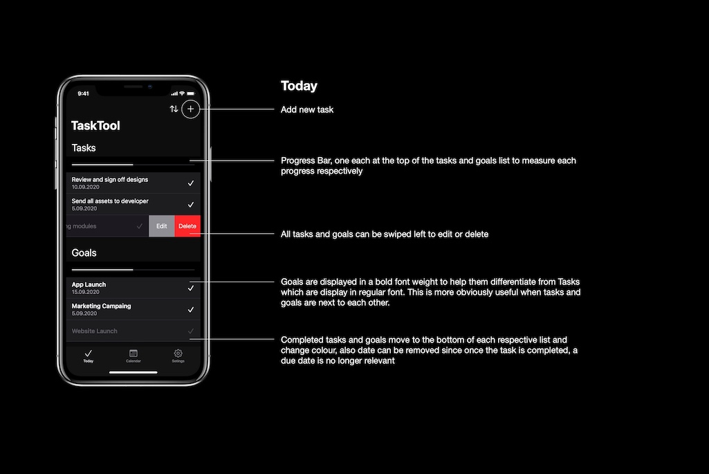

TaskTool is a goal-oriented app currently in development, which is being released for both iOS and Android. It allows high-level business or personal driven goals to be set and tracked. Sub-tasks can be set up to help breakdown the overall goals into smaller, more achievable, bite-sized steps. Small goals are easier to achieve on a regular basis, which means we can set them more often, build off them, and constantly see ourselves getting better. Seeing regular progress is the most motivating and inspiring thing you can do! TaskTool is perfectly placed to help you or others within your business make your goals a reality. 

The menus and general user interfaces will closely follow the respective iOS and Android native environments to make it easy to use, with a familiar feel. 

You can download TaskTool here: [Download TaskTool](https://www.tasktool.app/tasktool/download)